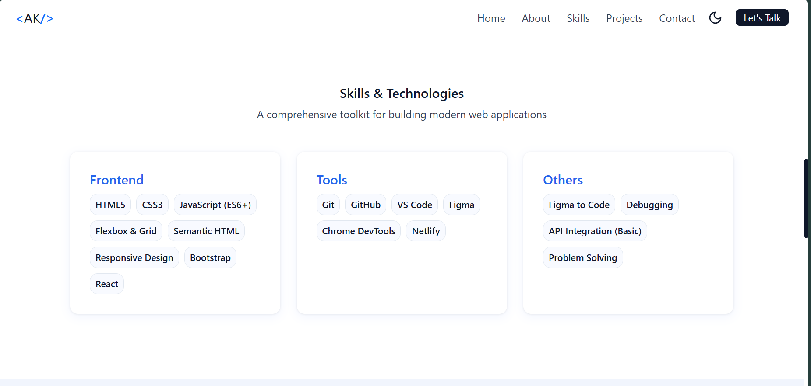
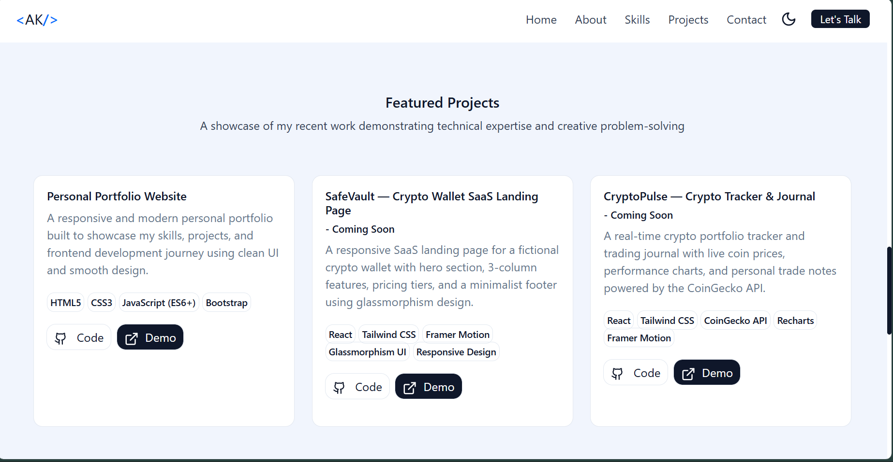
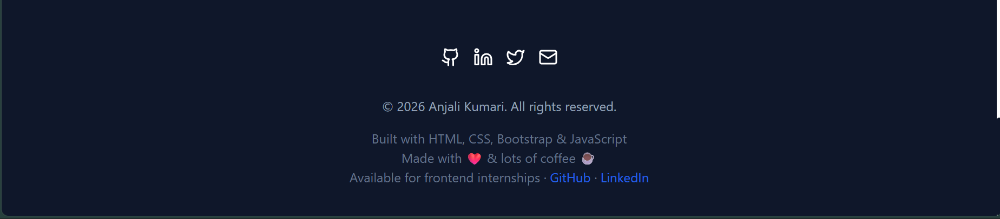

# 🌐 My Personal Portfolio

A responsive personal portfolio website built using **HTML, CSS, and JavaScript Bootstrap** to showcase my skills, projects, and web development journey.


> 💛 If this project helped or inspired you, a **star means a lot** — it keeps me motivated to build more!  
> [](https://github.com/akvr000/frontend-portfolio/)

---

## 🚀 About

Hi, I’m a BCA student passionate about frontend development and software engineering.  
I enjoy building clean, responsive, and user-friendly web interfaces while continuously improving my development skills.

This portfolio is a reflection of my learning journey and the projects I’ve built so far.

---

## 🛠️ Built With

- HTML5
- CSS3
- JavaScript
- Bootstrap

---

## ✨ Features

- 📱 Fully responsive — works on all screen sizes
- 🎨 Modern, clean UI design
- 🌙 Dark / Light mode toggle with localStorage preference saved
- ⌨️ Typing effect animation in hero section
- 💼 Projects showcase section
- 📬 Contact form
- 📄 Downloadable CV/Resume
- 🎨 CSS Variables — all colors and spacing in one place, easy to customize
- 🔝 Smooth scrolling + back-to-top button

---

## 📁 Project Structure

```text
portfolio/
│
├── index.html                  ← Main HTML file (all sections)
│
├── css/
│   ├── main.css                ← Imports all CSS files in order
│   │
│   ├── base/
│   │   ├── variables.css       ← CSS custom properties (colors, spacing, themes)
│   │   ├── global.css          ← Body, fonts, section labels, scrollbar
│   │   └── reset.css           ← Box-sizing, margin/padding reset
│   │
│   ├── components/
│   │   ├── navbar.css          ← Header, nav links, theme toggle
│   │   ├── hamburger.css       ← Hamburger menu & mobile nav styles
│   │   ├── back-to-top.css     ← Back to top button
│   │   ├── buttons.css         ← All button styles (hero, project, download CV)
│   │   └── customized-scrollbar.css ← Custom scrollbar styles
│   │
│   ├── layout/
│   │   ├── hero.css            ← Hero section, typing effect, scroll arrow
│   │   ├── about.css           ← About grid, quick facts card
│   │   ├── skills.css          ← Skill cards
│   │   ├── projects.css        ← Project cards
│   │   ├── contact.css         ← Contact form, info panel
│   │   └── footer.css          ← Footer layout, social icons
│   │
│   └── ui/
│       ├── bg-blob-effect.css  ← Background blob animation
│       ├── pop-message.css     ← Pop/toast message styles
│       ├── scroll-arrow.css    ← Scroll arrow indicator
│       ├── status-badge.css    ← Status badge (available for work, etc.)
│       └── typing-effect.css   ← Typing animation styles
│
├── js/
│   ├── main.js                 ← Main JS entry point
│   ├── theme.js                ← Dark/light theme toggle with localStorage
│   ├── hamburger.js            ← Hamburger menu functionality
│   ├── back-to-top.js          ← Back to top button functionality
│   └── typing-effect.js        ← Typing animation logic
│
└── assets/
    ├── icons/
    │   └── favicon.svg         ← Browser tab icon
    ├── images/
    │   ├── Hero.png            ← Hero section image
    │   ├── About.png           ← About section image
    │   ├── Skills.png          ← Skills section image
    │   ├── Projects.png        ← Projects section image
    │   ├── Contact.png         ← Contact section image
    │   └── Footer.png          ← Footer section image
    └── cv/
        └── CV.pdf              ← Downloadable CV
```

---

## 📸 Preview

## Hero Page


## About Page


## Skills Page


## Projects Page


## Contact Page


## Footer Page


---

## 🔗 Live Website

[Click here to view portfolio](https://akvr000.github.io/frontend-portfolio/)

---

## 🎯 What I Learned

- Building responsive layouts with Flexbox and CSS Grid
- DOM manipulation and event handling in JavaScript
- Improving UI/UX design instincts through iteration
- Structuring a complete frontend project from scratch
- Real-world development workflow (version control, file organization, deployment)

---

## ⭐ Future Improvements

- Add backend for contact form  
- Add more interactive animations  
- Improve accessibility and performance  
- Add blog section  

---

## ⚠️ License & Usage

This is my **original personal work**.
- ✅ You're welcome to use the **code structure** as inspiration or a learning reference
- ✅ You may fork and adapt it for your own portfolio with your own content
- ❌ Please **do not copy the design, content, or CV as-is** and present it as your own
- ❌ Do not plagiarize — this portfolio represents my personal identity and work

If you find it helpful, please consider giving a ⭐ and [following me on GitHub](https://github.com/akvr000) — it genuinely motivates me to keep building and sharing! 🙏

---

## 📬 Contact

- GitHub: [visit GitHub Profile](https://github.com/akvr000)    
- LinkedIn: [visit GitHub Profile](https://linkedin.com/in/akvr000)

---

<p align="center">Made with consistency, caffeine, and a bit of frustration 😄</p>

