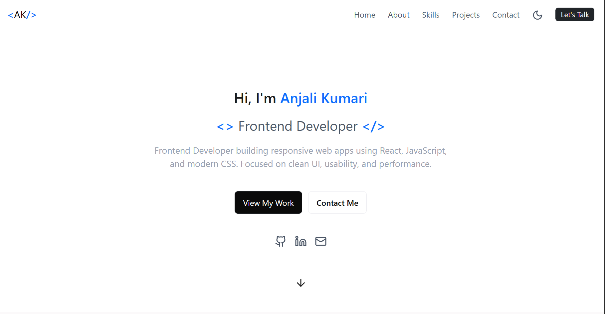
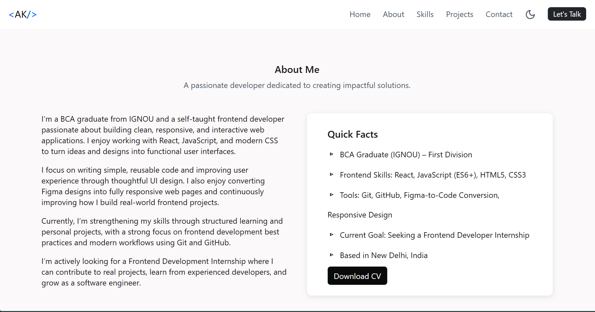
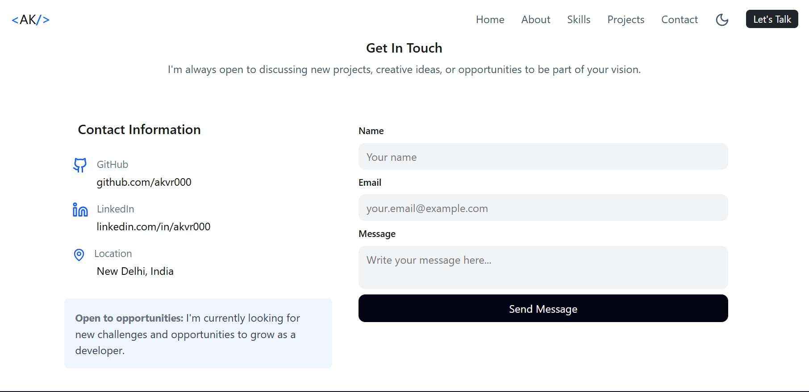

# 🌐 My Personal Portfolio

A responsive personal portfolio website built using **HTML, CSS, and JavaScript Bootstrap** to showcase my skills, projects, and web development journey.

## 🚀 About

Hi, I’m a BCA student passionate about frontend development and software engineering.  
I enjoy building clean, responsive, and user-friendly web interfaces while continuously improving my development skills.

This portfolio is a reflection of my learning journey and the projects I’ve built so far.

## 🛠️ Built With

- HTML5
- CSS3
- JavaScript
- Bootstrap

## ✨ Features

- Responsive design for all devices 
- Modern and clean UI design 
- Smooth scrolling navigation  
- Dark/Light mode toggle  
- Projects showcase section  
- Contact form  
- Downloadable resume/CV  

## 📸 Preview

## Hero Page

## About Page

## Contact Page

## 🔗 Live Website

[Click here to view portfolio](your-live-link-here)

## 🎯 What I Learned

- Building responsive layouts using Flexbox and Grid  
- DOM manipulation using JavaScript  
- Improving UI/UX design skills  
- Structuring a complete frontend project  
- Working with real-world project workflow  

## 📬 Contact

- GitHub: [visit GitHub Profile](https://github.com/akvr000)    
- LinkedIn: [visit GitHub Profile](https://linkedin.com/in/akvr000) 

## ⭐ Future Improvements

- Add backend for contact form  
- Add more interactive animations  
- Improve accessibility and performance  
- Add blog section  

---

Made with consistency, caffeine, and a bit of frustration 😄